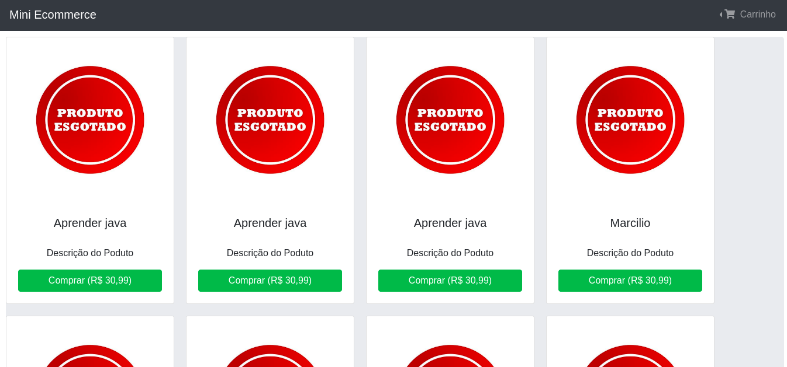
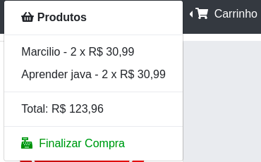
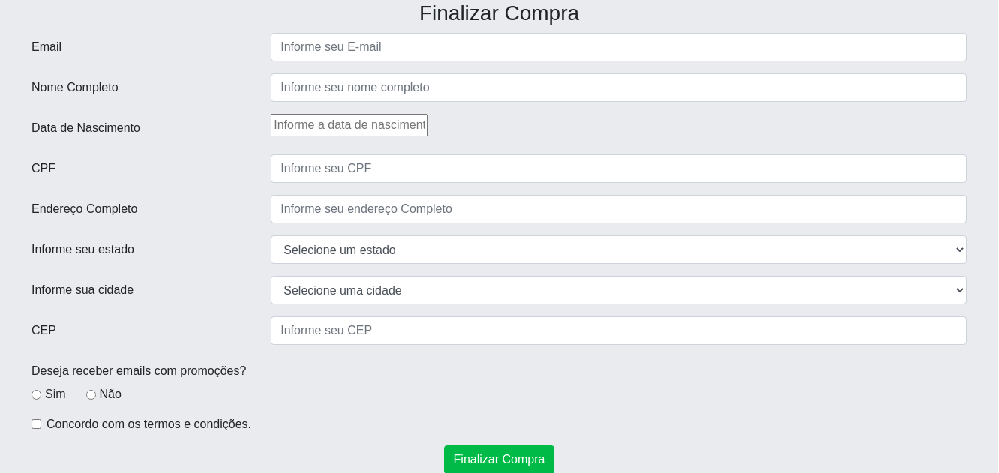
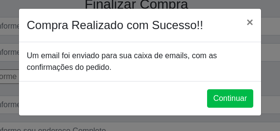
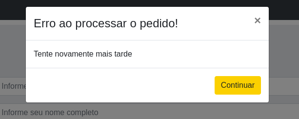

# Projeto Mini-Ecommerce
* Projeto para treinamento na tecnologia Reactjs, onde vamos contruir um mini-ecommerce, onde essas informações vão está em um projeto que é api, porém esa api está fazendo o armazenamento na memoria.

* Dentro do <b>README</b> da pasta do projeto está tudo que está sendo usando.
   * https://github.com/thiagoadssilva/udemyMiniEcommerce/blob/main/frontend/README.md

   

## Caminho para o projeto API
    https://github.com/thiagoadssilva/udemyListaTarefasApi

## Projeto Publicado
- http://ecommerce.tfcoder.com/

## <b>Telas:</b> 

